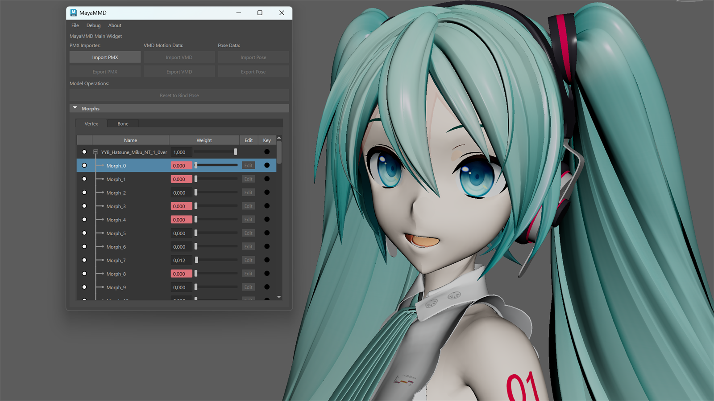

# MayaMMD for Autodesk Maya

[](https://opensource.org/licenses/MIT)
[](https://github.com/sstarosz/MayaMMD/actions/workflows/pr-checks.yml)
[](https://github.com/sstarosz/MayaMMD/actions/workflows/release.yml)
[](https://www.python.org/)
[](https://www.autodesk.com/products/maya)
[]()

Import and animate MMD (MikuMikuDance) models in Autodesk Maya.

Supports **PMX** models, **VMD** motions, and **VPD** poses — with bone hierarchies, IK handles, skinning, materials, morph targets, and more. Runs on **Maya 2024 and later** on Windows, Linux, and macOS.

> **Alpha version:** MayaMMD is in early development. The current focus is **read-only** — importing models, motions, and poses for viewing and animation. Editing, adding, modifying, or deleting models is not yet supported, and several MMD features are still missing (see below).



## Features

✅ Supported &nbsp; | &nbsp; 🔄 Partial &nbsp; | &nbsp; ❌ Not yet supported

**PMX Model Import**

- ✅ Mesh geometry — positions, normals, UVs, triangle faces
- ✅ Bone hierarchy — full parent/child structure, tail joints, rest-pose capture
- ✅ BDEF1/2/4 smooth skinning
- 🔄 Custom CCD IK solver — works for animation playback; manual manipulation can break (last bone doesn't always reach the IK handle)
- ✅ INHERIT_ROTATION / INHERIT_TRANSLATION constraints
- 🔄 Materials — imported via `openPBRSurface` (Maya's shader, not MMD's); material system will be redesigned in the future
- ✅ Vertex morphs — Maya blendShape, editable in Shape Editor
- ✅ Bone morphs — custom DG node with quaternion SLERP
- 🔄 SDEF/QDEF skinning — falls back to BDEF2
- 🔄 Fixed axis / local coordinate — enforced during VMD/VPD apply, not interactively in the viewport
- 🔄 Rigid bodies — visible guide meshes (kinematic FOLLOW_BONE bodies follow their bones; dynamic PHYSICS/PHYSICS_BONE bodies are simulated)
- 🔄 Physics simulation — native `mmdPhysicsNode` (embedded Bullet 3.25) simulates dynamic bodies, joints and DG write-back (Milestone 2); soft bodies and full MMD determinism not yet
- ❌ Sphere, toon, edge materials and ambient color
- ❌ UV, group, and material morphs
- ❌ PMX export

**VMD Motion**

- ✅ Bone keyframes — quaternion SLERP with Bezier interpolation
- ✅ Morph weight animation — drives blendShape and bone morph targets
- ✅ IK-compatible animation through the custom CCD solver
- ❌ Camera, light, and shadow keyframes (parsed but not applied)
- ❌ Animation layers for multi-VMD stacking
- ❌ VMD export

**VPD Pose**

- ✅ Full-body pose import with optional keyframing
- ✅ IK chain and fixed-axis handling
- ❌ VPD export

**Workflow & UI**

- ✅ Dockable Maya workspaceControl panel
- ✅ Pose editor with morph weight sliders
- 🔄 Reset to Bind Pose — currently broken
- ✅ Multiple models in one scene — selection-based targeting
- 🔄 Undo — individual operations undoable, not the whole import

## Installation

### Quick Install (Drag & Drop)

1. **Download** the latest release zip from the [Releases page](https://github.com/sstarosz/MayaMMD/releases).
2. **Extract** the zip to any folder.
3. **Drag** `install.py` onto the Maya viewport.
4. Click **Install** in the confirmation dialog — the plugin loads automatically.
5. Click the **MayaMMD** shelf button (or run `MayaMMD` in the Script Editor) to open the UI.

> **Note:** If the shelf button doesn't appear, open **Plugin Manager**
> (`Windows → Settings/Preferences → Plugin Manager`), find `MayaMMD`,
> and check **Loaded**.  You'll only need to do this once — Maya remembers
> loaded plugins across restarts.

### Manual Installation

1. Inside the release zip, find the folder matching your Maya version and OS:
   - Maya 2024 → `MayaMMD-Maya2024-<Platform>/`
   - Maya 2025 → `MayaMMD-Maya2025-<Platform>/`
   - Maya 2026 → `MayaMMD-Maya2026-<Platform>/`
   - Maya 2027 → `MayaMMD-Maya2027-<Platform>/`
2. Copy **both** `MayaMMD.mod` and the `MayaMMD/` folder into your Maya
   modules directory (see platform paths below).
3. Restart Maya.
4. Open **Plugin Manager** (`Windows → Settings/Preferences → Plugin Manager`).
5. Find `MayaMMD` and check **Loaded**.

Platform-specific modules directory:
- **Windows:** `C:\Users\<username>\Documents\maya\<version>\modules\`
- **Linux:** `~/maya/<version>/modules/`
- **macOS:** `~/Library/Preferences/Autodesk/maya/<version>/modules/`

### Auto-Load on Maya Startup

MayaMMD installs as a Maya Module, so it loads automatically on startup
once installed.  No `userSetup.py` changes are needed.

If you installed manually and the plugin doesn't auto-load, open
**Plugin Manager** and check **Auto-load** next to `MayaMMD`.

> **⚠️ Windows Defender / SmartScreen — false positive:** The plugin `.mll` is
> **not code-signed**, so Windows Defender or SmartScreen may occasionally flag
> the release zip or the `.mll` as a "virus". This is a **false positive**
> common with unsigned plugins and third-party builds — the project is open
> source, so you can always verify the binary by building it from source or by
> checking the file on [VirusTotal](https://www.virustotal.com/).
>
> If Windows blocks it, allow it once:
> 1. Open **Windows Security → Virus & threat protection → Protection history**.
> 2. Find the MayaMMD entry and choose **Actions → Allow on device** (or **Restore**).
> 3. If the plugin still won't load, add an exclusion for your Maya
>    `modules`/`plug-ins` folder under
>    **Windows Security → Virus & threat protection → Exclusions → Add**.

## Development

### Prerequisites

- **Maya 2026** (or 2024/2025/2027) with the Maya SDK installed
- **CMake 3.21+**
- **Visual Studio 2022** (Windows) with C++ desktop workload
- **Python 3.11** (matching your Maya version)

### One-Time Setup

1. **Build and install** the native plugin:

   ```bash
   cmake --preset maya2026-release
   cmake --build out/build/maya2026-release
   cmake --install out/build/maya2026-release
   ```

   The `.mll` ends up in `out/install/maya2026-release/plug-ins/` —
   **not** in the source tree.

   > **Note:** The Maya SDK is proprietary Autodesk software and is **not**
   > included in this repository. On the first `cmake --preset ...` run,
   > CMake auto-downloads the SDK for your Maya version into `out/.sdk/`
   > (requires Python 3.10+). To use an existing SDK instead, pass
   > `-DSDK_DIR=/path/to/maya-sdk`.

2. **Configure Maya** to find the plugin. Copy the generated module file
   into Maya's modules directory:

   | Platform | Command                                                                                         |
   | -------- | ----------------------------------------------------------------------------------------------- |
   | Windows  | `copy out\install\maya2026-release\MayaMMD.mod "%USERPROFILE%\Documents\maya\2026\modules\"`    |
   | Linux    | `cp out/install/maya2026-release/MayaMMD.mod ~/maya/2026/modules/`                              |
   | macOS    | `cp out/install/maya2026-release/MayaMMD.mod ~/Library/Preferences/Autodesk/maya/2026/modules/` |

3. **Remove old Maya.env entries** (if any). The `.mod` file handles
   `MAYA_PLUG_IN_PATH` and `PYTHONPATH` automatically — manual entries in
   `Maya.env` that point to the project root or `mmd/` may conflict.

4. **Launch Maya** — `MayaMMD` should appear in Plugin Manager.

### Daily Workflow

- **C++ or Python changes** → rebuild + install, then **Plugin Manager → unload → reload**

  ```bash
  cmake --build out/build/maya2026-release && cmake --install out/build/maya2026-release
  ```
- **Run integration tests**:

  ```bash
  ctest --preset default -L maya
  ```

> **Note:** Maya standalone (`mayapy`) does **not** process `.mod` files.
> Integration tests use direct `MAYA_PLUG_IN_PATH` + `PYTHONPATH` environment
> variables set by CTest — no manual configuration needed.

## Assets

MayaMMD ships without bundled models, motions, or poses — you add your own
files for testing and development. Binary asset files are **gitignored** and
never committed to the repository; only the helper scripts and `README.md`
files are tracked.

```
assets/
├── models/             # Place .pmx model files here
├── motions/            # Place .vmd motion files here
├── poses/              # Place .vpd pose files here
├── models_database/    # Generated model metadata (JSON)
├── motions_database/   # Generated motion metadata (JSON)
├── poses_database/     # Generated pose metadata (JSON)
├── pmx_model_files.py  # Generated: PMX file list
├── vmd_motion_files.py # Generated: VMD file list
├── vpd_pose_files.py   # Generated: VPD file list
└── assets_utils.py     # Helpers used by tests and scripts
```

### Adding assets

1. Place files in the matching folder:
   - `assets/models/` — `.pmx` model files
   - `assets/motions/` — `.vmd` motion files
   - `assets/poses/` — `.vpd` pose files
2. Regenerate the file lists so tests and benchmarks can discover them:

   ```bash
   python scripts/database/generate_file_list.py
   ```

   This scans `assets/models|motions|poses` and updates
   `assets/pmx_model_files.py`, `assets/vmd_motion_files.py`, and
   `assets/vpd_pose_files.py`.

### Building the metadata database

Structured JSON metadata (used for testing, statistics, and regression checks)
is extracted into the `*_database/` folders:

```bash
python scripts/database/extract_model_info.py   # → assets/models_database/
python scripts/database/extract_motion_info.py  # → assets/motions_database/
python scripts/database/extract_pose_info.py    # → assets/poses_database/
```

Utility scripts:

```bash
python scripts/database/format_json.py   # Pretty-print JSON dumps
python scripts/database/minify_json.py   # Minify JSON dumps before publishing
```

> **Note:** Your models/motions/poses and the generated database JSON files
> are gitignored and are **not** part of the repository. Add your own files —
> tests will automatically discover them.