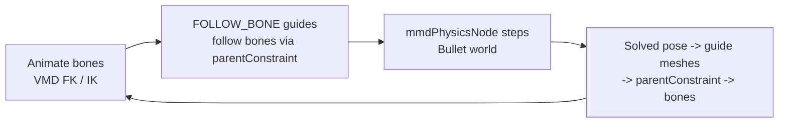

# PMX Physics — Bullet Rigid Bodies & Joints

## Overview

Design document for simulating MMD (PMX) physics in MayaMMD. PMX rigid bodies
and joints map 1:1 onto Bullet primitives (MMD itself uses Bullet), so the goal
is to faithfully reproduce the MMD per-frame binding loop — bones drive
kinematic `FOLLOW_BONE` colliders, Bullet steps the world, and dynamic colliders
drive their related bones back.

**Status (2026-08-06):** the simulation engine is a **native C++ `mmdPhysicsNode`
(an `MPxNode` in `MayaMMD.mll`) that embeds Bullet 3.25**. The previous
mayaBullet binding layer is **gone** — it froze under Cached Playback because
`bulletSolverShape` is a *stateful* node whose outputs Cached Playback treats as
pure functions of their inputs (so it never re-steps the solver, dynamic bodies
froze at rest, and the write-back constraints then locked the skeleton — "lost
mesh binding"). The C++ node owns the Bullet world, steps inside `compute()`,
and **declares itself non-cacheable** (`getCacheSetup`), so the evaluation
manager always re-evaluates it every frame — the mechanism a built-in solver
could not use.

Milestone 2 is functional end-to-end: `build_pmx_scene(pmx)` always creates one
`mmdPhysicsNode` per model with every PMX rigid body and joint, the simulation
advances during playback / evaluation, and dynamic bodies write their solved
pose back to the skeleton. Verified on all 17 bundled models (187/187 rigid-body
tests, including **behavioral** tests that step time and assert the bodies
actually move and the bones follow).

Audience: developers adding or maintaining the physics feature.

---

## Quick Reference

### Rigid body → Bullet mapping

| PMX field                     | Bullet counterpart                                | Notes                                                                                                                                                                                                                                                                         |
| ----------------------------- | ------------------------------------------------- | ----------------------------------------------------------------------------------------------------------------------------------------------------------------------------------------------------------------------------------------------------------------------------- |
| `shape`                       | `btBoxShape` / `btSphereShape` / `btCapsuleShape` | Sphere: `size.x` = radius. Box: `size` = half-extents. Capsule: `size.x` = radius, `size.y` = cylinder length (total height = `size.y + 2·size.x`); `btCapsuleShape` is Y-axis (`m_upAxis=1`) like MMD's vertical capsule and the polyCylinder guide mesh — no extra rotation |
| `shape_position`              | rigid body origin                                 | MMD space, Z-flip on import                                                                                                                                                                                                                                                   |
| `shape_rotation`              | rigid body orientation                            | MMD Euler (radians, XYZ order) — converted via handedness flip                                                                                                                                                                                                                |
| `mass`                        | `btRigidBody` mass                                | kinematic bodies get mass 0 in the node                                                                                                                                                                                                                                       |
| `move_attenuation`            | linear damping                                    | `damping = attenuation` (clamped [0,1]) — MMD's attenuation IS the damping coefficient (1.0 = fully damped)                                                                                                                                                                   |
| `rotation_damping`            | angular damping                                   | `damping = rotation_damping` (clamped [0,1])                                                                                                                                                                                                                                  |
| `repulsion`                   | restitution                                       | clamped [0,1]                                                                                                                                                                                                                                                                 |
| `friction_force`              | friction                                          | clamped [0,1]                                                                                                                                                                                                                                                                 |
| `group_id` (byte)             | collision group                                   | `1 << group_id`                                                                                                                                                                                                                                                               |
| `non_collision_group` (int16) | collision mask                                    | `(~non_collision_group) & 0xFFFF` base, then corrected with proximity-based group unions (see Collision masks below)                                                                                                                                                          |
| `physics_mode`                | kinematic / dynamic                               | See modes below                                                                                                                                                                                                                                                               |
| `related_bone_index`          | —                                                 | Bone binding for the per-frame loop                                                                                                                                                                                                                                           |

### Physics modes

| Enum | Name           | Behaviour                                                          |
| ---- | -------------- | ------------------------------------------------------------------ |
| `0`  | `FOLLOW_BONE`  | Kinematic/static — snapped to the bone every frame, not simulated  |
| `1`  | `PHYSICS`      | Dynamic — simulated with gravity; full transform written to bone   |
| `2`  | `PHYSICS_BONE` | Dynamic — simulated, pivoted at the bone; rotation written to bone |

### Joint types → Bullet constraints

| PMX `type`        | Bullet constraint                                                                                                                                                                                                                                                                             |
| ----------------- | --------------------------------------------------------------------------------------------------------------------------------------------------------------------------------------------------------------------------------------------------------------------------------------------- |
| `SPRING_6DOF` (0) | **`btGeneric6DofSpring2Constraint`** for *every* SPRING_6DOF joint — this is MMD's own mapping. Equal lower==upper limits are a **locked** axis in spring-2 (Bullet treats `lo==hi` as `LOCKED`, `lo>hi` as FREE, `lo<hi` as LIMITED); zero springs on a locked axis behave like a rigid weld |
| `SIX_DOF` (1)     | `btGeneric6DofConstraint`                                                                                                                                                                                                                                                                     |
| `P2P` (2)         | `btPoint2PointConstraint`                                                                                                                                                                                                                                                                     |
| `CONETWIST` (3)   | `btConeTwistConstraint`                                                                                                                                                                                                                                                                       |
| `SLIDER` (4)      | `btSliderConstraint`                                                                                                                                                                                                                                                                          |
| `HINGE` (5)       | `btHingeConstraint`                                                                                                                                                                                                                                                                           |

Joint fields: `rigid_body_index_a/b`, frame (`position`+`rotation`), per-axis
linear/angular limits (`position_min/max`, `rotation_min/max`) and spring
constants (`position_spring_constant`, `rotation_spring_constant`).

**Rigid-link weld:** a `SPRING_6DOF` with all-zero spring constants and
all-zero limits is a rigid link in the PMX spec. MMD's physics engine maps
**every** SPRING_6DOF joint to `btGeneric6DofSpring2Constraint`, and Bullet
interprets equal `lo == hi` limits as a **locked** axis (`m_currentLimit` =
LOCKED) rather than a springy one — so a fully-rigid chain link is a spring-2
with all six axes locked and no springs. This is both MMD-faithful and stable:
the earlier `btFixedConstraint` (and before that, `btGeneric6DofConstraint`
with clamped tiny limits, which behaved like an underdamped spring on long
chains) were replaced by it. Joints with real limits (e.g. the ±0.175 rad sway
joints, or springy skirt joints) keep their limits/springs on the same
spring-2 constraint (a locked axis uses the constraint's `STOP_ERP`, a
spring-enabled axis uses the PMX spring constant).

**Collision masks:** the PMX `non_collision_group` is the base mask, but
converted game models frequently ship **degenerate** collision data where every
body only collides with its OWN group (e.g. the Tololo PMX: skirt mask
`0x0004`, legs mask `0x0002`) — in that state the skirt passes straight through
the legs because neither mask includes the other's group, in both directions.
The **node** applies a **proximity-based correction** instead of blanket unions
(Phase 2: this logic moved out of `rigid_body_builder._compute_collision_masks`
into `mmd/maya/nodes/mmd_physics_masks.h`, compiled into the plugin):

- For each pair of bodies the builder tests whether their rest-pose extents
  overlap (`center distance < extentᵢ + extentⱼ + 0.2`). Only *overlapping*
  kinematic groups are OR'd into a dynamic body's mask, and only overlapping
  dynamic groups into a kinematic body's mask. This preserves the intended
  body↔cloth contact (skirt vs legs/hips, which touch at rest) without
  over-broadening: a blanket "collide with every kinematic group" made small
  cloth bodies (e.g. the bangs) collide with a huge torso capsule they rest
  inside of, which kept shoving them around (jitter). Proximity keeps Beg
  colliding only with the head group it rests on.
- **Dynamic bodies** still clear their OWN group bit: MMD models store chain
  bodies (hair/skirt spheres) deeply overlapping, and if they self-collide the
  overlap contacts push the chain apart — because the locked weld axes are
  compliant (ERP 0.2) the chain slowly extends ("the bang is longer than
  normal"). Like a well-configured MMD model, hair strands pass through each
  other but still collide with the body.
- **Cloth-on-cloth (bangs/skirt):** the kinematic correction only covers
  body↔cloth. Converted game models also ship masks where e.g. the bangs
  (Beg chain, anchored to the torso) do NOT collide with the skirt (also
  anchored to the torso) — so the bangs hang free, sag into the skirt and
  swing "under the arm" instead of resting ON the jacket colliders. A second
  correction adds the skirt group to the bangs (and vice-versa), guarded by:
  - *Chains* — connectivity uses dynamic bodies only (kinematic bodies never
    merge chains); jointed bodies in the same chain never collide, and a cape
    that merely shares the torso anchor with the bangs is a separate chain.
  - *Anchor* — two cloth chains only interact when jointed to the SAME body
    part (same collision group of their FOLLOW_BONE anchor, e.g. both anchored
    to the torso). The bangs and the skirt both hang off the torso; the sleeve
    hangs off the arm and the hair off the head, so bangs↔sleeve/hair are
    never added (colliding two hanging chains shoves both around).
  - *Drape* — the chains must actually drape: some body of one chain must
    genuinely interpenetrate a body of the other at rest (centre distance <
    extents sum − 0.15). A mere touch (the cape tips brushing the jacket back
    0.11 deep) does NOT qualify. Once a chain drapes, EVERY body of it that
    overlaps the other chain gains its group, so the bangs tail (which only
    touches the skirt) still rests on it — it hangs off the draping middle.
  - *Small drapes large* — only a SHORT cloth chain (≤ 10 bodies) resting on
    a LARGE cloth sheet (≥ 50 bodies) qualifies: the bangs (8 bodies) draping
    the skirt (144) is exactly this. This keeps the rule from adding
    collisions in models with different cloth layouts (a big skirt draping
    small belts/ribbons, two small ribbons, long hair chains) — validated
    that such additions destabilize the sim.

The bangs rest ON the jacket colliders (they are displaced to the jacket
surface by the contact; the skirt, which rests on the legs, barely moves).

This *adds* collisions (body ↔ cloth, cloth ↔ cloth), so it can make
previously-clipping cloth interact properly; the hair self-collision removal
is the one *removing* change. Both verified stable across all 17 bundled
models.

**Gravity:** exactly **-9.8** (MMD's value, in the model's own unit scale). Do
not scale it by model size — the bundled models are stored 10x (the Tololo PMX
is ~19 units tall) and a 10x gravity made every force 10x too strong.

**Anchor orientation (critical):** Maya matrices are row-vector (`world =
local * parentWorld`; `local = world * parentInverse` exactly), so
`mayaMatrixToBtTransform` must TRANSPOSE the Maya basis to build Bullet's
column-vector matrix (`bm[c][r] = m(r,c)`). Copying the row matrix directly
gave every rotated kinematic anchor a transposed (wrong) orientation, yanking
the attached chains into a mess.

**Scrub-back / rewind:** on `dt < 0` the node REBUILDS the Bullet world and
initializes every dynamic body at its rest pose transformed by the CURRENT
skeleton pose — not at the PMX rest pose (the skeleton is at another frame →
hair/skirt would hang at rest and the animation look broken). Python maps each
dynamic body to the kinematic anchor of its nearest kinematic-ancestor bone
(`bodyResetAnchorIndex`); the node captures each anchor's rest pose at build and
refreshes its current pose every frame, then on rewind sets
`target = anchorCurrent * (anchorRest⁻¹ · bodyRest)` and zeroes velocities.
Rebuilding (rather than teleporting bodies in place) is essential: a teleport
left the solver's warm-start impulse state from the previous frame, so the
first step after a rewind catastrophically yanked the chains away from their
reset pose. A fresh world resumes cleanly — verified that forward playback
after a rewind matches normal playback to within ~0.08 units. (The related
bone's own live matrix is NOT fed into the node — it is write-back-driven and
creates a circular DG dependency that crashes.)

**Reacting to bones moved at a fixed time:** the node steps the sim when time
advances **or** when a kinematic anchor moves (a bone dragged in the viewport
without playback). MMD reacts to bone changes immediately — the attached chains
must follow at once, not on the next frame. `updateKinematicAnchors` detects
anchor movement against the previous frame's captured poses and triggers one
solver step (1/60 s) at the same time value. This step is skipped right after a
rewind (the rebuild already placed the chains correctly, and a step right after
a large teleport is what caused the resume explosion).

### Coordinate space

- PMX/MMD: left-handed, Y-up, +Z forward.
- Maya/Bullet: right-handed, Y-up.
- Position: `(x, y, -z)`.
- Rotation: `rotateX = -rx, rotateY = -ry, rotateZ = +rz` (degrees) is the exact
  handedness flip — `R_maya = F·R_mmd·F` with `F = diag(1, 1, -1)`.

**Maya rotate-XYZ convention (critical):** Maya's `rotate` attribute (rotateOrder
XYZ) builds the row-vector matrix `M_row = (Rz·Ry·Rx)ᵀ`. The node's
`eulerDegreesToQuat(rx,ry,rz)` therefore builds the Bullet column matrix
`Rz·Ry·Rx` as the quaternion product `qz·qy·qx`, and `quatToEulerXYZDegrees`
extracts `sin(ry) = -m[2][0]`, `rx = atan2(m[2][1], m[2][2])`,
`rz = atan2(m[1][0], m[1][1])` with dedicated gimbal-lock handling for
`ry = ±90°`. This was verified empirically against Maya 2026 — an earlier
implementation that used `Rx·Ry·Rz` (`qx·qy·qz`) rotated every gimbal-locked
body (e.g. shoulder / jacket pivots, common in real models) by 180°, which
displaced the write-back bones and broke mesh binding.

---

## Architecture

### The MMD per-frame loop



- `FOLLOW_BONE` bodies are **kinematic**: a `parentConstraint(joint, guide)`
  drives each guide mesh from its bone every frame (DG, works under Cached
  Playback). The guide's world/parent-inverse matrices feed the node's
  `anchorWorldMatrix` / `anchorParentInverseMatrix` inputs, so the Bullet world
  runs in the physics group's local space and the kinematic collider tracks the
  bone.
- `PHYSICS` / `PHYSICS_BONE` bodies are **dynamic**: the node writes each body's
  solved local transform to `outTranslate[i]` / `outRotate[i]`, connected
  straight into the guide mesh's translate/rotate. A `parentConstraint` (PHYSICS)
  or `orientConstraint` (PHYSICS_BONE) writes the solved pose back to the
  related bone so the skinned mesh deforms.
- The write-back direction (which bones physics drives) is the subtlest
  correctness point; see [Write-back to the skeleton](#write-back-to-the-skeleton).

### mmdPhysicsNode (C++ node with embedded Bullet)

`mmd/maya/nodes/mmd_physics_node.h/.cpp` — a plain `MPxNode` that owns a
`btDiscreteDynamicsWorld`:

- **Inputs**: `time`, `gravity` (`fps` is retained for backward compatibility
  and as the Phase-4 rebuild trigger, but `dt` is now derived from the scene's
  current time unit via `MTime` — see "Gravity / units"); `anchorWorldMatrix` + `anchorParentInverseMatrix`
  (matrix arrays, one per kinematic body — Phase 3 feeds the JOINT's world
  matrix + the physics group's world INVERSE, plus a baked `anchorOffset[k]`
  body<->bone rest offset); `bodies` compound array (rest pose, mass, damping,
  friction, restitution, collider type/size, kinematic flag, `bodyPhysicsMode`
  (0/1/2), raw `bodyGroupId` + `bodyNonCollisionGroup` — the node computes
  each body's effective collision mask itself in `buildWorld` via
  `mmd_physics_masks.h`); `joints` compound array (body A/B, type, frame,
  limits, springs); Phase 3 direct write-back: `groupWorldMatrix` (the physics
  group's world matrix), `bodyWriteBackOffset` (dense body-indexed baked
  world offset K = jointRestWorld * bodyRestWorld^-1), `bodyParentJointOffset`
  (dense body-indexed baked M_parent = parentJointRestWorld *
  parentBodyRestWorld^-1) plus the per-body child `bodyParentBodyIndex` (the
  parent joint's body index — the node derives the parent inverse from that
  body's solved Bullet transform; -1 = no parent body → DG
  `bodyParentInverseMatrix` fallback).
- **compute()**: on first evaluation reads bodies/joints and builds the world
  (`buildWorld`); on time change updates the kinematic anchors (`local =
  world * parentInverse`), steps `stepSimulation(dt, 8, 1/60)`, and writes each
  dynamic body's solved local translate/rotate to the outputs. Scrubbing
  backwards (`dt < 0`) rebuilds the world (deterministic rewind).
- **Config auto-rebuild (Phase 4)**: every evaluation hashes the config inputs
  (gravity, fps, every bodies/joints value + count, anchor counts) with FNV-1a
  (`computeConfigSignature`).  If the hash differs from the one captured at
  build time, the node destroys + re-reads + rebuilds the world in place —
  mass/damping/limits/collider edits take effect immediately (they are baked
  into the Bullet construction info, so without a rebuild an edit is a no-op),
  and the dynamic chains stay glued to the CURRENT skeleton pose (no rewind
  teleport to rest).  Every config input is wired with
  `attributeAffects` → `outTranslate`/`outRotate` so the node re-evaluates
  when they change, even while paused (the anchor matrix VALUES change every
  frame and are excluded from the hash — only their counts matter).
- **Cached Playback**: `getCacheSetup` calls
  `MNodeCacheDisablingInfoHelper::setUnsafeNode` so the node is **never cached**
  and is re-evaluated every frame. This is the single fix that makes a stateful
  simulator work under Cached Playback — the mayaBullet solver could not declare
  this.

The node solves in the **physics group's local space** (anchors are converted
with `world * parentInverse`), so the whole model can be placed anywhere and the
simulation stays attached.  Outputs are keyed by **body index** — kinematic
bodies produce no output element.  Phase 3: the outputs are the **JOINT-LOCAL**
pose (`boneLocal = K * bodyLocal * groupWorld * parentInverse`, see
[Write-back to the skeleton](#write-back-to-the-skeleton)), so they connect
straight into the joints.

**Teardown order (crash fix):** `btCollisionWorld`'s destructor iterates its
collision objects and destroys their broadphase proxies, so `destroyWorld()`
must destroy the **world first** while every body is still alive, and only then
delete the bodies/constraints/shapes. The dispatcher, broadphase, collision
configuration, solver and all collision shapes are owned by the node (Bullet
does not own them) and freed exactly once — deleting bodies before the world
was a use-after-free that crashed Maya intermittently during scene teardown.

### Node graph per model

| Node                    | Type                              | Purpose                                                                                                                |
| ----------------------- | --------------------------------- | ---------------------------------------------------------------------------------------------------------------------- |
| `{model}_Physics`       | transform group                   | Bullet world frame; parents the solver locator                                                                         |
| `{model}_PhysicsSolver` | `mmdPhysicsNode` (MPxLocatorNode) | Owns the Bullet world, steps every frame, DRAWS the colliders, writes the solved pose DIRECTLY into the related joints |

Phase 3: **no guide transforms and no write-back constraints exist** — the
physics group contains ONLY the solver locator.  The node draws the colliders
(wireframe box/sphere/capsule per body via its `MPxDrawOverride`) and drives the
joints directly.

### Guide visualization (Phase 1 — node-drawn; no scene guides since Phase 3)

The `mmdPhysicsNode` is an **`MPxLocatorNode`** that draws its own rigid-body
visualization through a C++ **`MPxDrawOverride`** (`mmd_physics_draw_override`):
wireframe box / sphere / capsule per body, colored by collision group from the
(ported) group palette, with kinematic (bone-following) colliders dimmed.  The
draw geometry is pulled in `prepareForDraw()` from the node's **current solver
state** — solved world poses when the Bullet world is built, rest poses before
first evaluation — so the viewport always shows exactly what the simulation
has.  Since Phase 3 there is no per-body scene object at all (no guide
transforms, no meshes, no shaders): the colliders exist only inside the node.

### Write-back to the skeleton

Phase 3: the node writes the solved pose **directly into the related joints** —
no guide transforms, no parentConstraint/orientConstraint.  The write-back
exactly reproduces what `parentConstraint(maintainOffset)` maintained (verified
empirically: `targetWorld = K * sourceWorld` with K constant in world space), so
rest poses stay EXACT and the model can be moved freely:

```
boneLocal = K * bodyLocal * B_parent^-1 * M_parent^-1
```

where `bodyLocal` is the solved body pose in the physics group's space (from
Bullet), `B_parent` is the **parent body's** solved Bullet transform (the node
owns every body), and `K = jointRestWorld * (bodyRestWorld)^-1` and
`M_parent = parentJointRestWorld * (parentBodyRestWorld)^-1` are **baked
world-frame offsets** (captured by Python at build; `bodyWriteBackOffset[i]`
and `bodyParentJointOffset[i]`).  Because `parentJointWorld = M_parent *
B_parent * groupWorld`, the `groupWorld` term cancels and the formula is EXACT
at rest for both kinematic and dynamic parents.  Kinematic anchors use the
mirror image: `anchorLocal = K_kin * jointWorld * groupWorldInverse` with
`K_kin = (bodyRestWorld) * jointRestWorld^-1` (`anchorOffset[k]`).

**Why the parent inverse comes from the parent BODY (cycle fix):** the original
write-back read the related joint's `parentInverseMatrix` from the DG.  For a
body whose parent JOINT is also node-driven (the whole skirt/hair/cape chains —
86% of dynamic bodies on Tololo), `parentInverseMatrix` depends on the parent
joint's `worldMatrix`, which depends on the node's own `outRotate` — a live DG
feedback cycle (Maya allows the connection) that made the simulation explode
during animation (up to 54-unit bone displacements).  The node now derives the
parent inverse from the parent BODY's Bullet transform, so the write-back of
every joint depends only on its own body and the parent body — never on a
node-driven joint's DG matrix.  `bodyParentInverseMatrix` is kept ONLY as a
fallback for bodies whose parent bone has no rigid body (that parent is never
node-driven, so it cannot feed back).

- `FOLLOW_BONE` (mode 0): `joint.worldMatrix[0]` feeds `anchorWorldMatrix[k]`
  and `group.worldInverseMatrix[0]` feeds `anchorParentInverseMatrix[k]`; the
  collider tracks the joint with the baked offset.
- `PHYSICS` (mode 1): the node connects `outTranslate[i]` + `outRotate[i]`
  straight into the joint's `translate`/`rotate` (full transform).
- `PHYSICS_BONE` (mode 2): only `outRotate[i]` is connected (rotation-only,
  the joint keeps its skeleton translation).

At rest `bodyLocal = bodyRest`, `B_parent = parentBodyRest`, and
`K * bodyRest * B_parent^-1 * M_parent^-1` telescopes to
`jointRestWorld * parentJointRestWorld^-1` = the joint's rest local — verified 0
mismatched bones across all 17 models.

### Headless stepping

Interactive playback is pure DG (the node's output connections pull it each
time step).  Headless/batch use calls `step_physics(node)` then
`write_back_physics(node, driven_joints)` (re-evaluate the solver + the driven
joints).  NOTE: `step_physics` demands the node's `outTranslate`
plug (not a bare `dgeval(node)`), because `dgeval` on the locator shape does not
reliably pull the solver outputs (verified during the Phase 1 locator
conversion — the sim only advanced when a guide transform was read).

---

## Implementation Details

### Rigid-body build layer (`mmd/maya/pmx/rigid_body_builder.py`)

`create_physics_from_pmx_data()` (pure functions, no in-memory binding; the
scene is the source of truth — discover physics state later with
`mmd/maya/pmx_model_utils.py`, wrapped by `ModelContext.physics*` getters):

1. Create the `{model}_Physics` group and the `mmdPhysicsNode` locator
   (`{model}_PhysicsSolver`) parented under it (its object space is the group's
   local space, i.e. the Bullet world frame); connect `time1.outTime → node.time`,
   set `gravity = (0, -9.8, 0)` (`dt` is derived from the scene's time unit
   inside the node — no `fps` configuration needed).
2. Compute each body's rest pose in the group's local space (PMX rest, Z-flip +
   handedness) — **no guide transform is created** (Phase 3).  The node draws
   the visible collider (wireframe box/sphere/capsule, group-colored) through
   its C++ draw override.
3. Populate `node.bodies[i]` for every body (indices = PMX rigid-body index).
   Each element carries the **raw PMX** `bodyGroupId` + `bodyNonCollisionGroup`,
   `bodyPhysicsMode`; the node resolves effective masks itself
   (Phase 2 — the Python `_compute_collision_masks` was deleted, its logic lives
   in the plugin).
4. Feed the kinematic anchors from the JOINTS directly: `joint.worldMatrix[0]`
   → `anchorWorldMatrix[k]`, `group.worldInverseMatrix[0]` →
   `anchorParentInverseMatrix[k]`, and bake `anchorOffset[k]` (the world-frame
   body<->bone rest offset) in PMX kinematic order.
5. Direct write-back: connect `group.worldMatrix[0]` → `node.groupWorldMatrix`,
   bake `bodyWriteBackOffset[i]` (dense, body-indexed — the world offset
   K = jointRestWorld * bodyRestWorld^-1).  For each dynamic body whose parent
   BONE has a rigid body, set `bodies[i].bodyParentBodyIndex` to that body's
   index and bake `bodyParentJointOffset[i]` (M_parent — the parent inverse is
   derived from the parent BODY's solved transform inside the node, which
   removes the DG feedback cycle; see the write-back section).  Only bodies
   whose parent bone has NO body keep the DG `joint.parentInverseMatrix[0]` →
   `bodyParentInverseMatrix[i]` connection (that parent is never node-driven).
   Finally connect `node.outTranslate[i]`/`node.outRotate[i]` → the joint's
   `translate`/`rotate` (PHYSICS_BONE connects rotate only).
6. Populate `node.joints[j]` from PMX joints (frame Z-flip + handedness;
   angular limits stay in **radians** — the node passes them to Bullet; angular
   springs likewise; linear limits in units).
7. `caching=0` on the solver + the physics-driven joints (belt-and-suspenders
   on top of the native cache opt-out).

### Collision filtering

Resolved in the **node** at `buildWorld` time (Phase 2) — the Python builder no
longer pre-computes masks; it passes the raw PMX values through as attributes:

- `bodyGroupId` (short, default −1) → Bullet group bit `1 << group_id`. A value
  ≥ 0 overrides `bodyGroup` (the legacy explicit 64-bit group bit).
- `bodyNonCollisionGroup` (long, default −1) → groups this body does **not**
  collide with; Bullet's "collides with" mask is the complement
  `(~non_collision_group) & 0xFFFF`, then corrected by the proximity +
  cloth-on-cloth rules in `mmd/maya/nodes/mmd_physics_masks.h`
  (`computeEffectiveMasks`). When both are −1 the explicit `bodyGroup` /
  `bodyMaskGroup*` toggles are used verbatim.

### Gravity / units

MMD's physics engine uses exactly −9.8 (Bullet's default) in the model's own
unit scale; `gravity = (0, -9.8, 0)` matches MMD exactly (a 10× −98 guess made
every force 10× too strong and overloaded the rigid-weld constraints, so
hair/skirt chains sagged).  The node converts Maya frame deltas to seconds
straight through `MTime`: `dt = (nowMTime - lastMTime).as(MTime::kSeconds)` —
this adapts automatically to the scene's current time unit (film/game/custom
23.976 etc.), so there is no `fps` attribute to keep in sync.  The world is
sub-stepped at 1/60 s.

### Testing (behavioral, not just structural)

`tests/integration/maya/test_pmx_rigid_body_integration.py` checks structure
(node exists, body/joint counts, no guide transforms, joints wired to anchors /
outputs) **and behavior** (13 tests/model):

- **Write-Back No DG Cycle**: every dynamic body whose parent bone has a rigid
  body must have `bodies[i].bodyParentBodyIndex` set and
  `bodyParentJointOffset[i]` baked, and its `bodyParentInverseMatrix[i]` must
  NOT be connected to the DG (the cycle path); bodies with a no-body parent
  must not have a dynamic ancestor.
- **Simulation Steps**: swing the model's ROOT bone (the kinematic anchors
  track it — the MMD behavior) and assert the node's solved output for at
  least one dynamic body changed — "the sim reacts to the skeleton" signal.
- **Write-Back Moves Bone**: after swinging the root, assert the most-moved
  dynamic joint's LOCAL pose changed from rest — the node's output actually
  moved the BONE.
- **Config Edit Rebuilds Node (Phase 4)**: edit `bodies[i].bodyMass` mid-sim,
  force a re-eval, and assert the body becomes STATIC (mass 0 → static in
  Bullet — the deterministic proof the edit took effect and the world was
  rebuilt), stays glued to the current pose (no rewind teleport), and another
  dynamic body still moves (the rebuild did not freeze the world).

The behavioral tests swing the root bone because a **stable** sim does not move
the chains on its own — the old (buggy) write-back passed them by exploding
(moving joints tens of units); after the cycle fix the tests drive the skeleton
exactly as MMD animation does.

---

## Key Source Files

| File                                                                    | Purpose                                                                                                                         |
| ----------------------------------------------------------------------- | ------------------------------------------------------------------------------------------------------------------------------- |
| `mmd/core/data_types.py`                                                | `PMXRigidBody` / `PMXJoint` dataclasses + enums                                                                                 |
| `mmd/core/pmx_importer.py`                                              | Parsing rigid bodies + joints from the .pmx                                                                                     |
| `mmd/maya/pmx/rigid_body_builder.py`                                    | Rigid bodies: coord conversion + build functions (node + bodies/joints arrays + direct joint wiring + baked write-back offsets) |
| `mmd/maya/nodes/mmd_physics_node.h/.cpp`                                | The C++ `mmdPhysicsNode` with the embedded Bullet world                                                                         |
| `mmd/maya/nodes/mmd_physics_math.h`                                     | Maya-free math: Euler<->quat, row/column transpose, row-matrix multiply                                                         |
| `mmd/maya/nodes/mmd_physics_masks.h`                                    | Collision-mask resolver (`computeEffectiveMasks`: proximity + cloth-on-cloth corrections)                                       |
| `mmd/maya/nodes/ccd_ik_solver_node.h/.cpp`                              | Existing native node pattern the physics node follows                                                                           |
| `mmd/MayaMMD.cpp`                                                       | Registers `mmdPhysicsNode` natively                                                                                             |
| `vcpkg.json`                                                            | vcpkg manifest — Bullet 3.25 (float), built via the vcpkg toolchain                                                             |
| `mmd/maya/pmx_scene_builder.py`                                         | Scene build; calls (default-on) physics build                                                                                   |
| `mmd/maya/pmx_model_utils.py`                                           | Scene discovery: physics group / node / bodies (traced joints) / driven joints; bind-pose reset rewinds the solver              |
| `tests/integration/maya/test_pmx_rigid_body_integration.py`             | Structural + behavioral physics tests                                                                                           |
| `assets/models_database/GirlsFrontline/TololoDefault/rigid_bodies.json` | Real rigid-body test data                                                                                                       |

---

## References

- [PMX Custom Attributes Reference](./CustomAttributes.md)
- [Morph Implementation](./MorphImplementation.md)
- Bullet Physics Library: https://github.com/bulletphysics/bullet3
- MMD / PMX physics reference implementations: MMD itself, Blender `mmd_tools`,
  mmd-for-unity.
