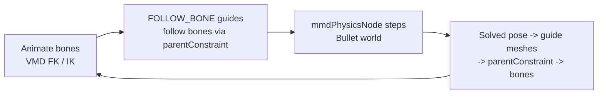

# PMX Physics — Bullet Rigid Bodies & Joints

## Overview

Design document for simulating MMD (PMX) physics in MayaMMD. PMX rigid bodies
and joints map 1:1 onto Bullet primitives (MMD itself uses Bullet), so the goal
is to faithfully reproduce the MMD per-frame binding loop — bones drive
kinematic `FOLLOW_BONE` colliders, Bullet steps the world, and dynamic colliders
drive their related bones back.

**Status (2026-08-06):** the simulation engine is a **native C++ `mmdPhysicsNode`
(an `MPxNode` in `MayaMMD.mll`) that embeds Bullet 3.25**. The previous
mayaBullet binding layer is **gone** — it froze under Cached Playback because
`bulletSolverShape` is a *stateful* node whose outputs Cached Playback treats as
pure functions of their inputs (so it never re-steps the solver, dynamic bodies
froze at rest, and the write-back constraints then locked the skeleton — "lost
mesh binding"). The C++ node owns the Bullet world, steps inside `compute()`,
and **declares itself non-cacheable** (`getCacheSetup`), so the evaluation
manager always re-evaluates it every frame — the mechanism a built-in solver
could not use.

Milestone 2 is functional end-to-end: `build_pmx_scene(pmx, build_physics=True)`
creates one `mmdPhysicsNode` per model with every PMX rigid body and joint, the
simulation advances during playback / evaluation, and dynamic bodies write their
solved pose back to the skeleton. Verified on all 17 bundled models (187/187
rigid-body tests, including **behavioral** tests that step time and assert the
bodies actually move and the bones follow).

Audience: developers adding or maintaining the physics feature.

---

## Quick Reference

### Rigid body → Bullet mapping

| PMX field                     | Bullet counterpart                                | Notes                                                                                                                                                                                                                                                                         |
| ----------------------------- | ------------------------------------------------- | ----------------------------------------------------------------------------------------------------------------------------------------------------------------------------------------------------------------------------------------------------------------------------- |
| `shape`                       | `btBoxShape` / `btSphereShape` / `btCapsuleShape` | Sphere: `size.x` = radius. Box: `size` = half-extents. Capsule: `size.x` = radius, `size.y` = cylinder length (total height = `size.y + 2·size.x`); `btCapsuleShape` is Y-axis (`m_upAxis=1`) like MMD's vertical capsule and the polyCylinder guide mesh — no extra rotation |
| `shape_position`              | rigid body origin                                 | MMD space, Z-flip on import                                                                                                                                                                                                                                                   |
| `shape_rotation`              | rigid body orientation                            | MMD Euler (radians, XYZ order) — converted via handedness flip                                                                                                                                                                                                                |
| `mass`                        | `btRigidBody` mass                                | kinematic bodies get mass 0 in the node                                                                                                                                                                                                                                       |
| `move_attenuation`            | linear damping                                    | `damping = attenuation` (clamped [0,1]) — MMD's attenuation IS the damping coefficient (1.0 = fully damped)                                                                                                                                                                   |
| `rotation_damping`            | angular damping                                   | `damping = rotation_damping` (clamped [0,1])                                                                                                                                                                                                                                  |
| `repulsion`                   | restitution                                       | clamped [0,1]                                                                                                                                                                                                                                                                 |
| `friction_force`              | friction                                          | clamped [0,1]                                                                                                                                                                                                                                                                 |
| `group_id` (byte)             | collision group                                   | `1 << group_id`                                                                                                                                                                                                                                                               |
| `non_collision_group` (int16) | collision mask                                    | `(~non_collision_group) & 0xFFFF` base, then corrected with proximity-based group unions (see Collision masks below)                                                                                                                                                          |
| `physics_mode`                | kinematic / dynamic                               | See modes below                                                                                                                                                                                                                                                               |
| `related_bone_index`          | —                                                 | Bone binding for the per-frame loop                                                                                                                                                                                                                                           |

### Physics modes

| Enum | Name           | Behaviour                                                          |
| ---- | -------------- | ------------------------------------------------------------------ |
| `0`  | `FOLLOW_BONE`  | Kinematic/static — snapped to the bone every frame, not simulated  |
| `1`  | `PHYSICS`      | Dynamic — simulated with gravity; full transform written to bone   |
| `2`  | `PHYSICS_BONE` | Dynamic — simulated, pivoted at the bone; rotation written to bone |

### Joint types → Bullet constraints

| PMX `type`        | Bullet constraint                                                                                                                                                                                                                                                                             |
| ----------------- | --------------------------------------------------------------------------------------------------------------------------------------------------------------------------------------------------------------------------------------------------------------------------------------------- |
| `SPRING_6DOF` (0) | **`btGeneric6DofSpring2Constraint`** for *every* SPRING_6DOF joint — this is MMD's own mapping. Equal lower==upper limits are a **locked** axis in spring-2 (Bullet treats `lo==hi` as `LOCKED`, `lo>hi` as FREE, `lo<hi` as LIMITED); zero springs on a locked axis behave like a rigid weld |
| `SIX_DOF` (1)     | `btGeneric6DofConstraint`                                                                                                                                                                                                                                                                     |
| `P2P` (2)         | `btPoint2PointConstraint`                                                                                                                                                                                                                                                                     |
| `CONETWIST` (3)   | `btConeTwistConstraint`                                                                                                                                                                                                                                                                       |
| `SLIDER` (4)      | `btSliderConstraint`                                                                                                                                                                                                                                                                          |
| `HINGE` (5)       | `btHingeConstraint`                                                                                                                                                                                                                                                                           |

Joint fields: `rigid_body_index_a/b`, frame (`position`+`rotation`), per-axis
linear/angular limits (`position_min/max`, `rotation_min/max`) and spring
constants (`position_spring_constant`, `rotation_spring_constant`).

**Rigid-link weld:** a `SPRING_6DOF` with all-zero spring constants and
all-zero limits is a rigid link in the PMX spec. MMD's physics engine maps
**every** SPRING_6DOF joint to `btGeneric6DofSpring2Constraint`, and Bullet
interprets equal `lo == hi` limits as a **locked** axis (`m_currentLimit` =
LOCKED) rather than a springy one — so a fully-rigid chain link is a spring-2
with all six axes locked and no springs. This is both MMD-faithful and stable:
the earlier `btFixedConstraint` (and before that, `btGeneric6DofConstraint`
with clamped tiny limits, which behaved like an underdamped spring on long
chains) were replaced by it. Joints with real limits (e.g. the ±0.175 rad sway
joints, or springy skirt joints) keep their limits/springs on the same
spring-2 constraint (a locked axis uses the constraint's `STOP_ERP`, a
spring-enabled axis uses the PMX spring constant).

**Collision masks:** the PMX `non_collision_group` is the base mask, but
converted game models frequently ship **degenerate** collision data where every
body only collides with its OWN group (e.g. the Tololo PMX: skirt mask
`0x0004`, legs mask `0x0002`) — in that state the skirt passes straight through
the legs because neither mask includes the other's group, in both directions.
The builder applies a **proximity-based correction** instead of blanket unions:

- For each pair of bodies the builder tests whether their rest-pose extents
  overlap (`center distance < extentᵢ + extentⱼ + 0.2`). Only *overlapping*
  kinematic groups are OR'd into a dynamic body's mask, and only overlapping
  dynamic groups into a kinematic body's mask. This preserves the intended
  body↔cloth contact (skirt vs legs/hips, which touch at rest) without
  over-broadening: a blanket "collide with every kinematic group" made small
  cloth bodies (e.g. the bangs) collide with a huge torso capsule they rest
  inside of, which kept shoving them around (jitter). Proximity keeps Beg
  colliding only with the head group it rests on.
- **Dynamic bodies** still clear their OWN group bit: MMD models store chain
  bodies (hair/skirt spheres) deeply overlapping, and if they self-collide the
  overlap contacts push the chain apart — because the locked weld axes are
  compliant (ERP 0.2) the chain slowly extends ("the bang is longer than
  normal"). Like a well-configured MMD model, hair strands pass through each
  other but still collide with the body.
- **Cloth-on-cloth (bangs/skirt):** the kinematic correction only covers
  body↔cloth. Converted game models also ship masks where e.g. the bangs
  (Beg chain, anchored to the torso) do NOT collide with the skirt (also
  anchored to the torso) — so the bangs hang free, sag into the skirt and
  swing "under the arm" instead of resting ON the jacket colliders. A second
  correction adds the skirt group to the bangs (and vice-versa), guarded by:
  - *Chains* — connectivity uses dynamic bodies only (kinematic bodies never
    merge chains); jointed bodies in the same chain never collide, and a cape
    that merely shares the torso anchor with the bangs is a separate chain.
  - *Anchor* — two cloth chains only interact when jointed to the SAME body
    part (same collision group of their FOLLOW_BONE anchor, e.g. both anchored
    to the torso). The bangs and the skirt both hang off the torso; the sleeve
    hangs off the arm and the hair off the head, so bangs↔sleeve/hair are
    never added (colliding two hanging chains shoves both around).
  - *Drape* — the chains must actually drape: some body of one chain must
    genuinely interpenetrate a body of the other at rest (centre distance <
    extents sum − 0.15). A mere touch (the cape tips brushing the jacket back
    0.11 deep) does NOT qualify. Once a chain drapes, EVERY body of it that
    overlaps the other chain gains its group, so the bangs tail (which only
    touches the skirt) still rests on it — it hangs off the draping middle.
  - *Small drapes large* — only a SHORT cloth chain (≤ 10 bodies) resting on
    a LARGE cloth sheet (≥ 50 bodies) qualifies: the bangs (8 bodies) draping
    the skirt (144) is exactly this. This keeps the rule from adding
    collisions in models with different cloth layouts (a big skirt draping
    small belts/ribbons, two small ribbons, long hair chains) — validated
    that such additions destabilize the sim.

The bangs rest ON the jacket colliders (they are displaced to the jacket
surface by the contact; the skirt, which rests on the legs, barely moves).

This *adds* collisions (body ↔ cloth, cloth ↔ cloth), so it can make
previously-clipping cloth interact properly; the hair self-collision removal
is the one *removing* change. Both verified stable across all 17 bundled
models.

**Gravity:** exactly **-9.8** (MMD's value, in the model's own unit scale). Do
not scale it by model size — the bundled models are stored 10x (the Tololo PMX
is ~19 units tall) and a 10x gravity made every force 10x too strong.

**Anchor orientation (critical):** Maya matrices are row-vector (`world =
local * parentWorld`; `local = world * parentInverse` exactly), so
`mayaMatrixToBtTransform` must TRANSPOSE the Maya basis to build Bullet's
column-vector matrix (`bm[c][r] = m(r,c)`). Copying the row matrix directly
gave every rotated kinematic anchor a transposed (wrong) orientation, yanking
the attached chains into a mess.

**Scrub-back / rewind:** on `dt < 0` the node REBUILDS the Bullet world and
initializes every dynamic body at its rest pose transformed by the CURRENT
skeleton pose — not at the PMX rest pose (the skeleton is at another frame →
hair/skirt would hang at rest and the animation look broken). Python maps each
dynamic body to the kinematic anchor of its nearest kinematic-ancestor bone
(`bodyResetAnchorIndex`); the node captures each anchor's rest pose at build and
refreshes its current pose every frame, then on rewind sets
`target = anchorCurrent * (anchorRest⁻¹ · bodyRest)` and zeroes velocities.
Rebuilding (rather than teleporting bodies in place) is essential: a teleport
left the solver's warm-start impulse state from the previous frame, so the
first step after a rewind catastrophically yanked the chains away from their
reset pose. A fresh world resumes cleanly — verified that forward playback
after a rewind matches normal playback to within ~0.08 units. (The related
bone's own live matrix is NOT fed into the node — it is write-back-driven and
creates a circular DG dependency that crashes.)

**Reacting to bones moved at a fixed time:** the node steps the sim when time
advances **or** when a kinematic anchor moves (a bone dragged in the viewport
without playback). MMD reacts to bone changes immediately — the attached chains
must follow at once, not on the next frame. `updateKinematicAnchors` detects
anchor movement against the previous frame's captured poses and triggers one
solver step (1/60 s) at the same time value. This step is skipped right after a
rewind (the rebuild already placed the chains correctly, and a step right after
a large teleport is what caused the resume explosion).

### Coordinate space

- PMX/MMD: left-handed, Y-up, +Z forward.
- Maya/Bullet: right-handed, Y-up.
- Position: `(x, y, -z)`.
- Rotation: `rotateX = -rx, rotateY = -ry, rotateZ = +rz` (degrees) is the exact
  handedness flip — `R_maya = F·R_mmd·F` with `F = diag(1, 1, -1)`.

**Maya rotate-XYZ convention (critical):** Maya's `rotate` attribute (rotateOrder
XYZ) builds the row-vector matrix `M_row = (Rz·Ry·Rx)ᵀ`. The node's
`eulerDegreesToQuat(rx,ry,rz)` therefore builds the Bullet column matrix
`Rz·Ry·Rx` as the quaternion product `qz·qy·qx`, and `quatToEulerXYZDegrees`
extracts `sin(ry) = -m[2][0]`, `rx = atan2(m[2][1], m[2][2])`,
`rz = atan2(m[1][0], m[1][1])` with dedicated gimbal-lock handling for
`ry = ±90°`. This was verified empirically against Maya 2026 — an earlier
implementation that used `Rx·Ry·Rz` (`qx·qy·qz`) rotated every gimbal-locked
body (e.g. shoulder / jacket pivots, common in real models) by 180°, which
displaced the write-back bones and broke mesh binding.

---

## Architecture

### The MMD per-frame loop

- `FOLLOW_BONE` bodies are **kinematic**: a `parentConstraint(joint, guide)`
  drives each guide mesh from its bone every frame (DG, works under Cached
  Playback). The guide's world/parent-inverse matrices feed the node's
  `anchorWorldMatrix` / `anchorParentInverseMatrix` inputs, so the Bullet world
  runs in the physics group's local space and the kinematic collider tracks the
  bone.
- `PHYSICS` / `PHYSICS_BONE` bodies are **dynamic**: the node writes each body's
  solved local transform to `outTranslate[i]` / `outRotate[i]`, connected
  straight into the guide mesh's translate/rotate. A `parentConstraint` (PHYSICS)
  or `orientConstraint` (PHYSICS_BONE) writes the solved pose back to the
  related bone so the skinned mesh deforms.
- The write-back direction (which bones physics drives) is the subtlest
  correctness point; see [Write-back to the skeleton](#write-back-to-the-skeleton).

### mmdPhysicsNode (C++ node with embedded Bullet)

`mmd/maya/nodes/mmd_physics_node.h/.cpp` — a plain `MPxNode` that owns a
`btDiscreteDynamicsWorld`:

- **Inputs**: `time`, `gravity`, `fps`; `anchorWorldMatrix` +
  `anchorParentInverseMatrix` (matrix arrays, one per kinematic body);
  `bodies` compound array (rest pose, mass, damping, friction, restitution,
  collider type/size, collision group/mask, kinematic flag); `joints` compound
  array (body A/B, type, frame, limits, springs).
- **compute()**: on first evaluation reads bodies/joints and builds the world
  (`buildWorld`); on time change updates the kinematic anchors (`local =
  world * parentInverse`), steps `stepSimulation(dt, 8, 1/60)`, and writes each
  dynamic body's solved local translate/rotate to the outputs. Scrubbing
  backwards (`dt < 0`) rebuilds the world (deterministic rewind).
- **Cached Playback**: `getCacheSetup` calls
  `MNodeCacheDisablingInfoHelper::setUnsafeNode` so the node is **never cached**
  and is re-evaluated every frame. This is the single fix that makes a stateful
  simulator work under Cached Playback — the mayaBullet solver could not declare
  this.

The node solves in the **physics group's local space** (anchors are converted
with `world * parentInverse`), so the whole model can be placed anywhere and the
simulation stays attached. Outputs are keyed by **body index** — kinematic
bodies produce no output element.

**Teardown order (crash fix):** `btCollisionWorld`'s destructor iterates its
collision objects and destroys their broadphase proxies, so `destroyWorld()`
must destroy the **world first** while every body is still alive, and only then
delete the bodies/constraints/shapes. The dispatcher, broadphase, collision
configuration, solver and all collision shapes are owned by the node (Bullet
does not own them) and freed exactly once — deleting bodies before the world
was a use-after-free that crashed Maya intermittently during scene teardown.

### Node graph per model

| Node                                         | Type                  | Purpose                                             |
| -------------------------------------------- | --------------------- | --------------------------------------------------- |
| `{model}_Physics`                            | transform group       | Organizes the guide meshes (Bullet world frame)     |
| `{model}_PhysicsSolver`                      | `mmdPhysicsNode` (DG) | Owns the Bullet world, steps every frame            |
| `{model}_Physics_RB{i}`                      | poly mesh transform   | Visible guide (sphere/box/capsule), shaded by group |
| `{model}_Physics_RB{i}_Jnt_parentConstraint` | DG constraint         | FOLLOW_BONE: bone→guide; PHYSICS: guide→bone        |
| (PHYSICS_BONE)                               | `orientConstraint`    | guide→bone, rotation only                           |

### Write-back to the skeleton

The guide mesh is the **driver**; the bone is the **driven** object:

- `FOLLOW_BONE`: `parentConstraint(joint, guide, maintainOffset=True)` — the bone
  drives the guide (and its collider).
- `PHYSICS`: `parentConstraint(guide, joint, maintainOffset=True)` — the solved
  guide drives the bone's full transform.
- `PHYSICS_BONE`: `orientConstraint(guide, joint, maintainOffset=True)` — the
  solved guide drives the bone's rotation only (pivoted at the bone).

`maintainOffset` captures the guide↔bone offset at creation, so at rest (solved
pose == rest pose) every bone stays exactly at its PMX position — verified
0 mismatches across all 17 models (the earlier Euler bug displaced them).

### Headless stepping

Interactive playback is pure DG (the node's output connections pull it each
time step). Headless/batch use calls `binding.step()` (`dgdirty` + `dgeval` on
the node) then `binding.write_back()` (propagate solved pose through the guides
and constraints).

---

## Implementation Details

### Binding layer (`mmd/maya/pmx/rigid_body_builder.py`)

`PhysicsBinding.create()`:

1. Create the `{model}_Physics` group and the `mmdPhysicsNode`
   (`{model}_PhysicsSolver`); connect `time1.outTime → node.time`, set
   `gravity = (0, -9.8, 0)`, `fps = 30`.
2. For every PMX rigid body create a **visible guide mesh** at the PMX rest pose
   (Z-flip + handedness), parented into the group, carrying
   `pmxRigidBodyIndex` / `pmxGroupId` / `pmxPhysicsMode` metadata. Each mesh is
   **shaded by collision group with one unique surface shader per group** —
   `openPBRSurface` on Maya 2024+ (color via `baseColor`), Lambert fallback on
   older releases (color via `color`) — sharing the `_RIGID_BODY_GROUP_COLORS`
   palette, so every group has its own recognizable color in the viewport.
   Bind the guide↔bone DG constraint (see above).
3. Populate `node.bodies[i]` for every body (indices = PMX rigid-body index).
4. Connect each FOLLOW_BONE guide's `worldMatrix[0]` +
   `parentInverseMatrix[0]` to `anchorWorldMatrix[k]` / `anchorParentInverseMatrix[k]`
   in PMX kinematic order.
5. Connect each dynamic guide's translate/rotate from
   `node.outTranslate[i].outTranslateValue` / `node.outRotate[i].outRotateValue`.
6. Populate `node.joints[j]` from PMX joints (frame Z-flip + handedness;
   angular limits stay in **radians** — the node passes them to Bullet; angular
   springs likewise; linear limits in units).
7. `caching=0` on all physics nodes (belt-and-suspenders on top of the native
   cache opt-out).

### Collision filtering

`group_id` (byte) → Bullet group bit `1 << group_id`.
`non_collision_group` (int16 bitmask) → groups this body does **not** collide
with; Bullet's "collides with" mask is the complement: `(~non_collision_group) & 0xFFFF`.

### Gravity / units

Open item: MMD uses −9.8 in its own unit scale; the Bullet world runs in Maya
units, so `-98` makes motion visible on the ~18-unit Tololo model. The exact
MMD-matching factor is still to be pinned down. `fps` converts Maya frame
deltas to seconds (`dt = (now - last) / fps`); the world is sub-stepped at
1/60 s.

### Testing (behavioral, not just structural)

`tests/integration/maya/test_pmx_rigid_body_integration.py` checks structure
(node exists, body/joint counts, guides at rest, colors, anchors, write-back
constraints) **and behavior**:

- **Simulation Steps**: step `cmds.currentTime` over the playback range and
  assert a dynamic body's solved position changes (> 1 cm).
- **Write-Back Moves Bone**: after stepping, assert the dynamic body's related
  bone moved (translation for PHYSICS, rotation for PHYSICS_BONE).

This is what the old mayaBullet suite could not detect — a frozen solver passed
every structural check.

---

## Key Source Files

| File                                                                    | Purpose                                                                             |
| ----------------------------------------------------------------------- | ----------------------------------------------------------------------------------- |
| `mmd/core/data_types.py`                                                | `PMXRigidBody` / `PMXJoint` dataclasses + enums                                     |
| `mmd/core/pmx_importer.py`                                              | Parsing rigid bodies + joints from the .pmx                                         |
| `mmd/maya/pmx/rigid_body_builder.py`                                    | Rigid bodies: coord conversion + palette + `PhysicsBinding` (node + guides + anchors + outputs + write-back) |
| `mmd/maya/nodes/mmd_physics_node.h/.cpp`                                | The C++ `mmdPhysicsNode` with the embedded Bullet world                             |
| `mmd/maya/nodes/ccd_ik_solver_node.h/.cpp`                              | Existing native node pattern the physics node follows                               |
| `mmd/MayaMMD.cpp`                                                       | Registers `mmdPhysicsNode` natively                                                 |
| `vcpkg.json`                                                             | vcpkg manifest — Bullet 3.25 (float), built via the vcpkg toolchain        |
| `mmd/maya/pmx_scene_builder.py`                                         | Scene build; calls (default-on) physics binding                                    |
| `tests/integration/maya/test_pmx_rigid_body_integration.py`             | Structural + behavioral physics tests                                               |
| `assets/models_database/GirlsFrontline/TololoDefault/rigid_bodies.json` | Real rigid-body test data                                                           |

---

## References

- [PMX Custom Attributes Reference](./CustomAttributes.md)
- [Morph Implementation](./MorphImplementation.md)
- Bullet Physics Library: https://github.com/bulletphysics/bullet3
- MMD / PMX physics reference implementations: MMD itself, Blender `mmd_tools`,
  mmd-for-unity.
