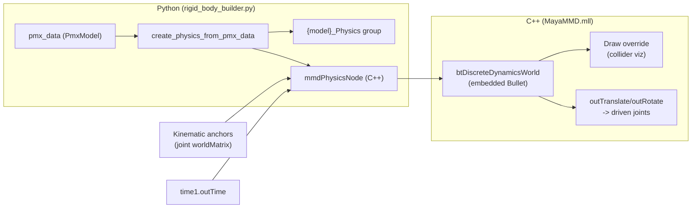

# Physics Integration — Scope & Design

Design + scope document for the **rigid-body physics feature** of MayaMMD.

This document answers three questions:

1. **What is the plugin allowed to do right now?** — the "read-only" constraint.
2. **What is the minimum scope for rigid bodies?** — what v1 must and must not do.
3. **What is the interface to the C++ solver node?** — the contract Python code
   builds against, plus the v1 UI.

It complements (and should stay consistent with)
[`docs/PhysicsImplementation.md`](PhysicsImplementation.md), which records
*how* the solver is implemented. This document records *what we commit to*.

Audience: developers adding or maintaining the physics feature.

---

## 1. Plugin scope — the "read-only" constraint

The plugin is currently an **import / apply / edit** tool. It can:

| Capability                               | Status                                                                       |
| ---------------------------------------- | ---------------------------------------------------------------------------- |
| Import PMX model                         | ✅ Working (`File → Import PMX`, `mmd.core.pmx_importer` → `build_pmx_scene`) |
| Import VMD animation                     | ✅ Working (`apply_vmd_to_scene` in `mmd/maya/vmd_scene_builder.py`)          |
| Import / apply VPD pose                  | ✅ Working (`mmd/maya/vpd_scene_builder.py`)                                  |
| Edit scene (bones, morphs, materials, …) | ✅ Working (Maya-native editing)                                              |
| Reset to bind pose                       | ✅ Working (UI button)                                                        |
| **Export PMX**                           | ❌ **Not implemented** — button exists, disabled                              |
| **Export VMD animation**                 | ❌ **Not implemented** — button exists, disabled                              |
| **Export VPD pose**                      | ❌ **Not implemented** — button exists, disabled                              |

### Constraint

> **Until all export functionality is implemented, the plugin stays
> read-only with respect to the file formats: it must never claim to
> "export" or "round-trip" a PMX / VMD / VPD, and the disabled export
> buttons stay disabled.**

Consequences for physics work:

- The **physics feature must not depend on export** to be useful. Its v1
  deliverable is *in-Maya simulation + tuning*, not baking physics into an
  exported file.
- Any physics state we want to survive a session lives **in the Maya scene**
  (custom attributes / node attributes), not in external files.
- We do **not** promise byte-faithful reproduction of a PMX file. The scene is
  the source of truth (see §6).

This constraint is deliberately temporary — it is lifted feature-by-feature as
export is implemented (export PMX → export VMD → export VPD).

---

## 2. Minimum scope — rigid bodies (v1)

### What v1 is

A working, tunable **per-model rigid-body simulation**:

1. **Python builds the rigid-body system per PMX model** and connects it to
   the C++ solver node. This already exists and is the entry point:
   `mmd.maya.pmx.rigid_body_builder.create_physics_from_pmx_data(...)`,
   called automatically by `build_pmx_scene(...)` (physics is always built).
2. **The C++ node solves physics.** The native `mmdPhysicsNode` (embedded
   Bullet 3.25) owns the world, steps every frame, and writes the solved pose
   back into the joints. See §4 for the interface contract.
3. **A basic UI to observe and tune the simulation** (see §7).

### v1 success criteria (testable)

- Importing any bundled PMX model creates one `mmdPhysicsNode` per model, with
  every PMX rigid body and joint present (bodies/joints arrays match the PMX
  data).
- Playback advances the simulation; dynamic bodies move; kinematic
  (`FOLLOW_BONE`) bodies track their bones; driven joints follow their bodies.
  (This is already covered by the behavioral rigid-body integration tests.)
- From the UI a user can: see the model's physics status, select a rigid body,
  edit its basic properties (mass / damping / friction / restitution /
  collider type+size / group / mask), and see the change take effect.
- Scrubbing backwards (rewind) restores the simulation deterministically.

### What v1 explicitly is NOT (non-goals)

- ❌ No physics baking / caching into the file formats (see §1).
- ❌ No per-frame animation export of physics results.
- ❌ No full "physics editor" (no multi-select drag-resize of colliders, no
  live joint-limit editing in the viewport, no physics authoring from
  scratch).
- ❌ No support for editing a model's physics in a way that gets re-imported
  into the PMX (that is the export/round-trip feature, deferred).
- ❌ No new solver features beyond what the node already implements (the
  stability decisions in `PhysicsImplementation.md` — gravity −9.8, no CCD,
  spring-2 rigid welds, proximity collision-mask correction — are accepted
  behavior, not v1 work).

### Scope rule of thumb

> **v1 physics = "import → simulate → observe → tune basic body properties in
> Maya". Anything that writes physics data back to a file, or that requires
> new C++ solver behavior beyond the current node, is out of scope.**

---

## 3. Architecture overview



- **Build time (Python)** — one group + one solver node per model; the node's
  `bodies`/`joints` compound arrays are populated from PMX data; kinematic
  anchors are connected from the joints; the solved pose is written **directly
  into the joints** (Phase 3 — no guide transforms, no constraint nodes).
- **Run time (C++)** — the node is time-driven and non-cacheable; on each
  evaluation it updates kinematic anchors, steps Bullet, and writes dynamic
  body poses to the outputs. The node also *draws* the colliders (wireframe,
  colored by collision group).
- **Discovery (Python)** — nothing is kept in memory; the scene is the source
  of truth. `mmd.maya.pmx_model_utils` re-discovers physics state from the
  scene on demand (wrapped by `ModelContext` getters).

---

## 4. C++ node interface — the contract

The node is `mmdPhysicsNode`, registered natively by `MayaMMD.mll`
(`mmd/maya/nodes/mmd_physics_node.{h,cpp}`, type id `0x0011C105`). It is an
**`MPxLocatorNode`** whose object space is the physics group's local space
(== the Bullet world frame).

### 4.1 Inputs

| Attribute                                             | Type                     | Indexing                | Meaning                                                                                                                                                                                             |
| ----------------------------------------------------- | ------------------------ | ----------------------- | --------------------------------------------------------------------------------------------------------------------------------------------------------------------------------------------------- |
| `time`                                                | time                     | —                       | Frame clock (`time1.outTime`). Drives stepping.                                                                                                                                                     |
| `gravity`                                             | double3                  | —                       | World gravity. **Must stay `(0, −9.8, 0)`** (MMD's value in model units).                                                                                                                           |
| `fps`                                                 | double                   | —                       | Retained for backward compatibility + as the Phase-4 rebuild trigger (`pmx_model_utils` toggles it); `dt` is derived from the scene's time unit via `MTime`, so it no longer drives the conversion. |
| `anchorWorldMatrix`                                   | matrix[]                 | kinematic order         | World matrix of each kinematic (`FOLLOW_BONE`) body's joint.                                                                                                                                        |
| `anchorParentInverseMatrix`                           | matrix[]                 | kinematic order         | Physics group's world inverse — keeps anchors in group space.                                                                                                                                       |
| `anchorOffset`                                        | matrix[]                 | kinematic order         | Baked world-frame body↔bone rest offset (`bodyRestWorld · jointRestWorld⁻¹`).                                                                                                                       |
| `groupWorldMatrix`                                    | matrix                   | single                  | Physics group's world matrix (write-back composition).                                                                                                                                              |
| `bodyWriteBackOffset`                                 | matrix[]                 | **dense, body-indexed** | `K = jointRestWorld · bodyRestWorld⁻¹` per body (identity for non-write-back).                                                                                                                      |
| `bodyParentInverseMatrix`                             | matrix[]                 | dense, body-indexed     | Related joint's `parentInverseMatrix` — **DG fallback only** (bodies whose parent joint has no body).                                                                                               |
| `bodyParentJointOffset`                               | matrix[]                 | dense, body-indexed     | `M_parent = parentJointRestWorld · parentBodyRestWorld⁻¹` (constant).                                                                                                                               |
| `bodies[i].bodyRestTranslate`                         | float3                   | PMX rb index            | Rest position in group space.                                                                                                                                                                       |
| `bodies[i].bodyRestRotate`                            | float3                   | PMX rb index            | Rest rotation, **degrees**.                                                                                                                                                                         |
| `bodies[i].bodyMass`                                  | double                   | PMX rb index            | Mass (kinematic bodies get 0).                                                                                                                                                                      |
| `bodies[i].bodyLinearDamping` / `bodyAngularDamping`  | double                   | PMX rb index            | Damping = PMX `move_attenuation` / `rotation_damping` (clamped [0,1]).                                                                                                                              |
| `bodies[i].bodyFriction` / `bodyRestitution`          | double                   | PMX rb index            | From `friction_force` / `repulsion` (clamped [0,1]).                                                                                                                                                |
| `bodies[i].bodyColliderType`                          | short                    | PMX rb index            | 1 box, 2 sphere, 3 capsule.                                                                                                                                                                         |
| `bodies[i].bodyRadius` / `bodyExtents` / `bodyLength` | double / float3 / double | PMX rb index            | Collider size (sphere: radius; box: half-extents; capsule: radius + cylinder length).                                                                                                               |
| `bodies[i].bodyMask`                                  | long                     | PMX rb index            | **Explicit collision mask override** (used verbatim when raw PMX data is absent).                                                                                                                   |
| `bodies[i].bodyGroupId`                               | short                    | PMX rb index            | Raw PMX group id 0..15 — the node derives the Bullet group bit `1 << (id & 0x0F)`.                                                                                                                  |
| `bodies[i].bodyNonCollisionGroup`                     | long                     | PMX rb index            | Raw PMX `non_collision_group` (unsigned) — the node computes the effective mask in `buildWorld` (`mmd_physics_masks.h`); `−1` = use `bodyMask`.                                                     |
| `bodies[i].bodyKinematic`                             | bool                     | PMX rb index            | Kinematic (anchor) vs dynamic.                                                                                                                                                                      |
| `bodies[i].bodyPhysicsMode`                           | short                    | PMX rb index            | PMX mode 0 FOLLOW_BONE / 1 PHYSICS / 2 PHYSICS_BONE.                                                                                                                                                |
| `bodies[i].bodyParentBodyIndex`                       | short                    | PMX rb index            | Rigid-body index of the related joint's **parent joint's body** (write-back parent-inverse source); `−1` = none.                                                                                    |
| `bodies[i].bodyResetAnchorIndex`                      | long                     | PMX rb index            | Kinematic anchor whose delta drives this body's scrub-back reset; `−1` = none.                                                                                                                      |
| `bodies[i].bodyNameLocal`                             | string                   | PMX rb index            | PMX body name local (`上半身2`, `Beg1`, …) for Query/UI; `""` = none.                                                                                                                               |
| `bodies[i].bodyNameUniversal`                         | string                   | PMX rb index            | PMX body name universal (`Jacket_0_0`/`Skirt_0_0`, …) for Query/UI; `""` = none.                                                                                                                    |
| `bodies[i].bodyEnabled`                               | bool                     | PMX rb index            | Remove support: `buildWorld` skips disabled bodies and joints referencing them.                                                                                                                     |
| `joints[j].bodyA` / `bodyB`                           | long                     | joint index             | Rigid-body indices (PMX rb indices).                                                                                                                                                                |
| `joints[j].type`                                      | long                     | joint index             | PMX joint type 0..5.                                                                                                                                                                                |
| `joints[j].frameTranslate` / `frameRotate`            | float3                   | joint index             | Joint frame position / rotation (rotation in **degrees**).                                                                                                                                          |
| `joints[j].linearMin/Max`, `angularMin/Max`           | float3                   | joint index             | Limits — angular in **radians** (passed straight to Bullet).                                                                                                                                        |
| `joints[j].linearSpring`, `angularSpring`             | float3                   | joint index             | Spring constants.                                                                                                                                                                                   |

### 4.2 Outputs

| Attribute                           | Type   | Indexing       | Meaning                                                                      |
| ----------------------------------- | ------ | -------------- | ---------------------------------------------------------------------------- |
| `outTranslate[i].outTranslateValue` | float3 | **body index** | Solved local translate (mode 1). Kinematic bodies → no element.              |
| `outRotate[i].outRotateValue`       | float3 | **body index** | Solved local rotate, **degrees** (modes 1/2). Kinematic bodies → no element. |

Outputs are keyed by **body index**; only dynamic bodies produce elements.
Maya auto-inserts a `unitConversion` between the raw double3 `outRotateValue`
and the angle-unit `joint.rotate` — discovery must follow its `output` plug.

### 4.3 Behavioral contract (invariants)

1. **Evaluation model.** The node is driven by `time1.outTime` and declares
   itself **non-cacheable** (`getCacheSetup` → `setUnsafeNode`) so Cached
   Playback re-evaluates it every frame. Python also sets `caching=0` on the
   solver and driven joints.
2. **Solves in the physics group's local space.** Anchors are converted with
   `world · parentInverse`; the model can be placed/moved anywhere.
3. **`compute()` lifecycle.**
   - First eval → lazy `buildWorld` (reads bodies + joints, computes masks,
     builds Bullet world) → writes rest (no step).
   - Time advances → update kinematic anchors, `stepSimulation(dt, 8, 1/60)`.
   - Time goes backwards (`dt < 0`, scrub/rewind) → **rebuild the world** and
     re-init dynamic bodies at rest × current skeleton pose
     (deterministic rewind; teleporting in place is NOT allowed — it leaves
     stale warm-start impulses).
   - **Config change** (bodies/joints/gravity/fps/anchors-count differ from the
     hashed build-time signature) → rebuild the world in place, keeping the
     chains glued to the current pose (no rewind teleport).
4. **Collision masks are computed in the node** from `bodyGroupId` +
   `bodyNonCollisionGroup` (proximity + cloth-on-cloth correction in
   `mmd_physics_masks.h`). Dynamic bodies' own group bit is cleared; kinematic
   bodies keep their exact PMX mask.
5. **Write-back is direct and cycle-free.** `boneLocal = K · bodyLocal ·
   B_parent⁻¹ · M_parent⁻¹` — the parent inverse comes from the **parent
   body's solved Bullet transform**, never from the DG, so node-driven parent
   joints cannot create a feedback cycle.
6. **Draw.** The node draws its own colliders (wireframe box/sphere/capsule,
   group-colored via `bodyGroupId`) through `MPxDrawOverride`; before the first
   eval it falls back to rest poses from the attributes.
7. **Headless stepping** is explicit: `step_physics(node)` does
   `dgdirty` + `dgeval(f"{node}.outTranslate")` (a bare `dgeval(node)` does not
   pull the custom outputs).

### 4.4 Interface stability rules

- The **bodies array is dense, indexed by PMX rb index**. The joints array is
  dense, indexed by joint index. Sparse arrays break the node's
  `jumpToArrayElement` reads (a sparse array was the cause of a 17-unit bone
  displacement bug — see `PhysicsImplementation.md`).
- Kinematic anchors are in **kinematic order** (the order FOLLOW_BONE bodies
  appear in the bodies array), NOT body-index order.
- Matrix arrays that feed the write-back are **dense body-indexed**.
- `bodyGroupId`/`bodyNonCollisionGroup` are the raw PMX values; explicit
  `bodyMask`/`bodyGroup` are overrides only used when the raw values are `−1`.
- Adding/removing child attributes of `bodies`/`joints` changes the config
  signature hash — old scenes stay valid (missing children default), but tests
  must be re-run. `bodyNameLocal`/`bodyNameUniversal` (string, default `""`)
  and `bodyEnabled` (bool, default `true`) were added for the Query/Remove
  capabilities — all are additive; `bodyEnabled` is hashed into the config
  signature (toggling it rebuilds the world), the names are not (no simulation
  effect).

---

## 5. Python interface

### 5.1 Build

| Function                                                                                                                   | Purpose                                                                                                                                                                                                                                             |
| -------------------------------------------------------------------------------------------------------------------------- | --------------------------------------------------------------------------------------------------------------------------------------------------------------------------------------------------------------------------------------------------- |
| `rigid_body_builder.create_physics_from_pmx_data(pmx_data, joints, name_registry, root_transform_obj=None) -> str \| None` | Builds the full physics graph: `{model}_Physics` group, `mmdPhysicsNode`, `bodies`/`joints` arrays, kinematic anchors, dynamic write-back connections, DG-cache opt-out. Returns the solver node name (or `None` for a model with no rigid bodies). |
| `rigid_body_builder.step_physics(node)`                                                                                    | Force one solver evaluation at the current time (headless use).                                                                                                                                                                                     |
| `rigid_body_builder.write_back_physics(node, driven_joints)`                                                               | Re-evaluate the solver outputs + driven joints (headless use).                                                                                                                                                                                      |

Called automatically from `pmx_scene_builder.build_pmx_scene(...)` (physics is always built).
The solver is stamped on the root (`pmxPhysicsNode` string attribute).

### 5.2 Discovery (scene = source of truth)

| Helper (`pmx_model_utils.py`)      | Returns                                                                                      |
| ---------------------------------- | -------------------------------------------------------------------------------------------- |
| `find_physics_group(root)`         | `{model}_Physics` transform, or `None`.                                                      |
| `find_physics_node(root)`          | The `mmdPhysicsNode`, or `None`.                                                             |
| `find_physics_rigid_bodies(root)`  | `{pmx_rb_index: related_joint}` for all bodies (kinematic via anchors, dynamic via outputs). |
| `find_physics_driven_joints(root)` | `{pmx_rb_index: joint}` for **dynamic** bodies only (write-back targets).                    |

`ModelContext` wraps these as lazy getters: `physicsGroup`, `physicsNode`,
`physicsRigidBodies`, `physicsDrivenJoints`.

### 5.3 Editing

Editing a body's properties is a plain `setAttr` on the node's `bodies[i]`
children. The node's Phase-4 config-rebuild picks the change up on the next
evaluation (even while paused), re-anchoring chains to the current pose — no
special "apply" step needed. This is the hook the v1 UI (§7) and the
`mmdRigidBody` command (§5.4) build on.

### 5.4 Rigid-body capability matrix & the `mmdRigidBody` command

The rigid-body feature is scoped by a **capability matrix** — the contract
for what the current scope supports and what is deferred to the export era:

| Capability | Status    | What it means                                                                                                                                                                                                                                                                                                                                                                                                                                                                                                                                           |
| ---------- | --------- | ------------------------------------------------------------------------------------------------------------------------------------------------------------------------------------------------------------------------------------------------------------------------------------------------------------------------------------------------------------------------------------------------------------------------------------------------------------------------------------------------------------------------------------------------------- |
| **Import** | ✅ current | One `mmdPhysicsNode` per model with every PMX rigid body + joint, built automatically at model import (`build_pmx_scene`). **SIMULATION IS DISABLED**: the node is not time-driven and no write-back wiring exists — import creates bodies (data + bone binding) and constraints via the native commands, then stops. **No command-level re-import** — re-importing the model is the way to restore physics. There is **no separate bulk importer and no Python wiring** (single body-modification path via `mmdRigidBody` + `mmdRigidBodyConstraint`). |
| **Query**  | 🚧 later   | Read body/joint data from the scene for the UI (list, counts, per-body detail). Backed by `bodyNameLocal`/`bodyNameUniversal` + the discovery helpers (§5.2).                                                                                                                                                                                                                                                                                                                                                                                           |
| **Apply**  | 🚧 later   | Batch configuration push (inverse of Query).                                                                                                                                                                                                                                                                                                                                                                                                                                                                                                            |
| **Edit**   | 🚧 later   | Modify individual PMX-exposed body fields via `mmdRigidBody -e`.                                                                                                                                                                                                                                                                                                                                                                                                                                                                                        |
| **Remove** | 🚧 later   | Disable individual bodies via `bodyEnabled` (no array reindexing).                                                                                                                                                                                                                                                                                                                                                                                                                                                                                      |
| **Export** | 🚧 future  | Write the (possibly edited) bodies + joints back into the PMX file. Deferred — matches the plugin-wide read-only scope (§1).                                                                                                                                                                                                                                                                                                                                                                                                                            |

#### The `mmdRigidBody` command

A NATIVE C++ `MPxCommand` (`mmd/maya/cmds/mmd_rigid_body_cmd.{h,cpp}`, registered
by `MayaMMD.cpp`'s `initializePlugin`) that follows the Maya create/edit/query
mode convention (default = create; `-e`/`-edit` and `-q`/`-query` enabled in
the syntax).  Plain flags only — **no JSON payloads**.

The command is C++ (not a Python MPxCommand) because the Python command layer
is fragile in this environment: Maya lazily calls `syntaxCreator()` the first
time a command is invoked, and in mayapy 2026 that crashed the process inside
OpenMaya's `MSyntax` constructor (the Python `MArgParser` multi-double flag
reads were also flaky).  Native `MSyntax` / `MArgParser` have neither issue.

**v1.0 — create (SIMULATION DISABLED)** (implemented):

```
mmdRigidBody <solver | modelRoot>      # create is the default mode
    -index <int>              # optional; must be the next free index (auto-append)
    -name <string>            # PMX body name (local) → bodies[i].bodyNameLocal
    -nameUniversal <string>   # PMX body name (universal) → bodies[i].bodyNameUniversal
    -bone <joint | pmxBoneIdx># related joint (name/path or PMX bone index)
    -shape <sphere|box|capsule>
    -size <x y z>             # PMX shape size → radius / extents / length
    -position <x y z>         # MMD space (Z-flip applied) → restT
    -rotation <x y z>         # MMD radians (handedness flip) → restR
    -mass <double> -linearDamping <double> -angularDamping <double>
    -friction <double> -restitution <double>
    -group <int> -nonCollisionGroup <int>
    -physicsMode <followBone|physics|physicsBone>
```

Create mode (the default — there is no `-create` flag) appends ONE rigid body
as **DATA + bone binding** and returns the new body index.  FOLLOW_BONE bodies
are bound to their related joint through the kinematic-anchor INPUT
(`joint.worldMatrix → anchorWorldMatrix` + baked body<->bone offset) — the
collider "lives on the correct bone" and displays from its rest pose (the
draw override falls back to the plugs when the world is never built).  Dynamic
bodies are **data-only** (no write-back, no stepping) — the simulation is
disabled because the write-back that drove joints exploded on import.
Edit/query/remove, batch modes, and re-enabling the simulation are later steps.

**Single body-modification path — no Python wiring.**  The Python builder's
`create_physics_from_pmx_data` is now just:

```
group = _create_physics_group(...)
node  = _create_physics_solver(...)                    # gravity / fps (NOT time-driven)
for rb in pmx_data.rigid_bodies:
    cmds.mmdRigidBody(node, ...)                # data + bone binding (no wiring)
for jt in pmx_data.joints:
    cmds.mmdRigidBodyConstraint(node, ...)      # constraints AFTER bodies
```

SIMULATION IS DISABLED: the solver is not connected to `time1.outTime`, no
write-back output is connected, and no `-finalize`/step runs — so import
cannot drive (or explode) any joint.  The node still holds every body's and
joint's data and displays the colliders from their rest poses.

#### The `mmdRigidBodyConstraint` command

A second NATIVE C++ command (`mmd/maya/cmds/mmd_rigid_body_constraint_cmd.{h,cpp}`,
registered in `MayaMMD.cpp`) — the C++ replacement for the former Python
`_set_joint_attributes`.  Create mode (default) appends ONE PMX joint
(constraint between two rigid bodies) to the node's `joints` array:

```
mmdRigidBodyConstraint <solver | modelRoot>   # create is the default mode
    -bodyA <int> -bodyB <int>     # PMX rigid-body indices the joint links
    -type <int>                   # PMX joint type 0..5
    -position <x y z>             # joint frame (MMD space; Z-flip applied)
    -rotation <x y z>             # joint frame (MMD radians; handedness flip)
    -linearMin <x y z> -linearMax <x y z>     # linear limits (PMX units)
    -angularMin <x y z> -angularMax <x y z>   # angular limits (PMX radians)
    -linearSpring <x y z> -angularSpring <x y z>
```

Data conversions match the old Python writer exactly.  NOTE: `MSyntax`
silently rejects SHORT flag names longer than 3 characters (a 4-char short
like `lmin` never registers — the long name is then unknown too), so the
limit/spring flags use 3-char shorts (`lmi`, `lma`, `ami`, `ama`).

#### C++ additions (both additive — old scenes stay valid)

| Child of `bodies[i]` | Type   | Default | Purpose                                                      |
| -------------------- | ------ | ------- | ------------------------------------------------------------ |
| `bodyNameLocal`      | string | `""`    | PMX body name (local) for Query/UI display.                  |
| `bodyNameUniversal`  | string | `""`    | PMX body name (universal) for Query/UI display.              |
| `bodyEnabled`        | bool   | `true`  | Remove support: `buildWorld` skips disabled bodies + joints. |

---

## 6. Scene as source of truth

No in-memory handle is kept. Everything needed to reconstruct the physics
state lives in the scene:

- Root: `pmxModelName`, `pmxPhysicsNode` (solver name).
- Joints: `pmxBoneData` compound (indices, names, rest pose, flags) — see
  `docs/CustomAttributes.md`.
- Solver node: the `bodies`/`joints` compound arrays + connections.

This means: save a `.ma`/`.mb`, reopen, and physics is still discoverable —
the constraint in §1 ("no file-format export") does not prevent scene-level
persistence, which is fully in scope.

---

## 7. UI scope — v1

The main widget (`mmd/ui/tool_main_widget.py`) currently has sections for
PMX import/export, VMD, VPD, Model Operations (Reset to Bind Pose), and a
Morphs tree. **There is no physics section yet.**

### 7.1 Minimum v1 UI (in scope)

A **"Physics" section** in the main widget, enabled when the active model has
a physics node:

1. **Status line** — model + solver presence, counts (`N bodies, M joints`),
   built from `ModelContext.physicsNode()` / `physicsRigidBodies()`.
2. **Reset to rest** button — resets the simulation to the current skeleton
   pose (deterministic rewind semantics, §4.3.3).
3. **Collider draw toggle** — show/hide the node's wireframe colliders
   (viewport locators on/off).
4. **Body list** — grouped by collision group (or flat), each row showing
   PMX body index, mode (kinematic/dynamic), collider type. Selecting a row
   selects the body in the viewport; selecting a collider in the viewport
   highlights the row.
5. **Selected-body properties** — editable: mass, linear/angular damping,
   friction, restitution, collider type + size, group, mask. Edits are plain
   `setAttr` on `bodies[i]` (live via config rebuild).

### 7.2 Deferred UI (NOT v1)

- ❌ Joint editing (limits/springs) — read-only display only at most.
- ❌ Simulation pause/resume toggle (needs a new node "enabled" input —
  defer; playback scrubbing + Reset covers v1).
- ❌ Multi-select / viewport manipulation of colliders.
- ❌ Physics bake/export UI.
- ❌ Per-group visibility layer management beyond the draw toggle.

### 7.3 UI placement

Follow the existing pattern: a collapsible Maya `frameLayout` containing Qt
widgets (the Morphs tree uses `cmds.frameLayout` + a wrapped Qt widget). Add a
`Physics` frame between "Model Operations" and "Morphs".

---

## 8. Non-goals (full list)

- File-format **export** of PMX / VMD / VPD (plugin-wide constraint, §1).
- Physics **baking** into files, or "physics capture" as an animation layer.
- PMX **round-trip** fidelity guarantees.
- New C++ solver behavior (features) beyond the current node — only interface
  fixes/additions required by the UI (e.g. an "enabled" input, if we decide
  pause is needed).
- Editing **joints** from the UI in v1.
- Multi-model orchestration beyond one-node-per-model (already the model).
- Support for physics in **other** DCC contexts (this is Maya-only).

---

## 9. Open questions / decisions

These block or refine parts of the v1 UI and should be resolved before or
during UI work:

1. **Pause/resume** — is a "simulate on/off" toggle required for v1, or is
   playback + Reset enough? If required, add a node `enabled` input (small C++
   change) — flag as scope expansion.
2. **Body list interaction** — do we need viewport→list selection sync in v1,
   or is list→viewport (select body from list) enough?
3. **Collider draw toggle** — should hiding be per-group (checkbox per group)
   or a single global toggle in v1?
4. **Body property editing** — which properties are "basic" for v1?
   Proposed: mass, damping×2, friction, restitution, collider type/size,
   group, mask. Confirm joint display stays read-only.
5. **Reset semantics** — "Reset to rest" should reset to the **current**
   skeleton pose (not the PMX rest pose) when an animation is loaded. Confirm
   this matches user expectation for v1.
6. **Where the physics section lives** — separate frame in the main widget vs.
   a dockable sub-panel. (Recommend: frame in the main widget, matching the
   Morphs pattern.)

**Resolved (2026-08-09)** — the `mmdRigidBody` command scope (§5.4): a native
C++ command following the Maya create/edit/query mode convention, **no JSON**
(plain flags only); body names live in C++ `bodyNameLocal`/`bodyNameUniversal`
children; Remove uses a C++ `bodyEnabled` flag (no reindexing); create = one
body per call (auto-append index); constraints go through the separate
`mmdRigidBodyConstraint` command; **SIMULATION IS DISABLED** (no write-back, no
stepping, node not time-driven); Edit/Query/Remove/Export and re-enabling the
simulation are later steps; there is no command-level re-import (Import = model
import only).

---

## 10. Related documents

- `docs/PhysicsImplementation.md` — how the solver is implemented (node
  internals, stability decisions, verified facts).
- `docs/CustomAttributes.md` — all custom attributes stored on scene nodes
  (bone data, etc.).
- `docs/MorphImplementation.md`, `docs/NamingConventions.md` — related
  feature docs.
- `mmd/maya/pmx/rigid_body_builder.py` — the Python build/discovery code.
- `mmd/maya/nodes/mmd_physics_node.{h,cpp}` — the C++ node (the interface in
  §4 is mirrored there; keep both in sync).
